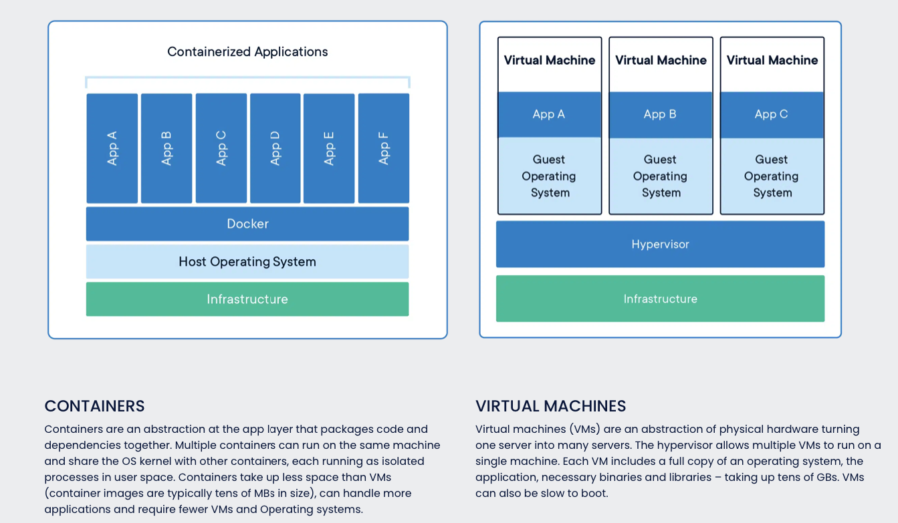

# Aula-1
## O que são Containers?

É uma instancia dentro de uma imagem. Você pode criar, iniciar, parar, mover ou deletar um container utilizando a API de Docker ou mesmo a Docker cli para ter ambientes isolados, empacotar aplicacoes com objetivo de segregar e facilitar a portabilidade dessas aplicações.

Containers, embora possam rodar em um mesmo "servidor" eles sao isolados entre si e rodam os proprios softwares, binarios e configurações.

Isso quer dizer que containers são diferentes de Maquinas Virtuais pois as Maquinas Virtuais são uma abstração do Hardware Fisico apenas, concorrendo diretamente aos recursos de CPU e Memoria e, por exemplo, mantendo esses processos em uma área comum de memória. Já os containers, são isolados, o que quer dizer que, independende de quantos estejam rodando, eles são processos separados, ou seja, isolados um do outro, mais leves e não compartilham um mesmo espaço de memória.

>Referência: https://www.docker.com/resources/what-container/