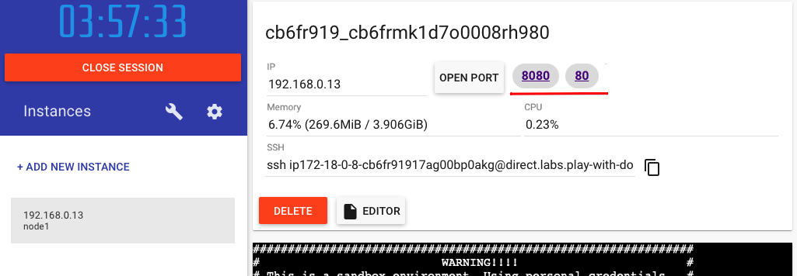

# Aula-2
## Como executar um container?

Para executar um container você precisa rodar o comando [docker run](https://docs.docker.com/engine/reference/run/) com alguns parametros, neste exemplo iremos utilizar os parametros: 

```text
-d detach mode (o continer irá executar em background)
-p porta-local:porta-container (define a porta que iremos usar para acessar o container)
```

Como ainda não temos o Docker Cli disponivel em nossa máquina, iremos utilizar o (play with docker)[https://labs.play-with-docker.com] uma vez realizado seu cadastro gratuito, você só ira precisar cliar em __+ ADD NEW INSTANCE__ e rodar os comandos abaixo.

Exemplo:

```bash
docker run -d -p 80:80 docker/getting-started
```
Este container pode ser acessivel via navegador apenas clicando no icone indicado no site
> Caso você já tenha o Docker instalado e queira rodar localmente, o endereço para acesso será http://localhost

Você pode ter mais de um container acessivel via browser, vamos iniciar outro container de exemplo.
Lembre-se de configurar outra porta de acesso ou então não iremos conseguir iniciar o container.

```bash
docker run -d -p 8080:80 cassioliveiram/ascan-ia:aula2
```
Este container pode ser acessivel via navegador apenas clicando no icone indicado no site
> Caso você já tenha o Docker instalado e queira rodar localmente, o endereço para acesso será http://localhost:8080




>Nota: Caso você rode o container sem o parametro -d utilize __ctrl + c__ para interromper o processo.
>Nota: Caso você rode o container sem o parametro -p rodeo novamente definindo outra porta-local.
>Referência: https://docs.docker.com/engine/reference/run/
